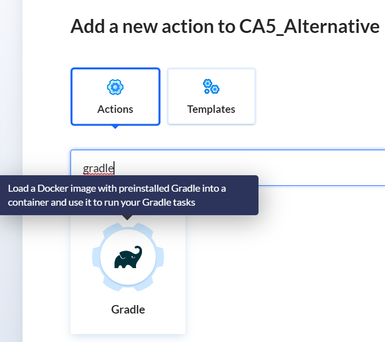
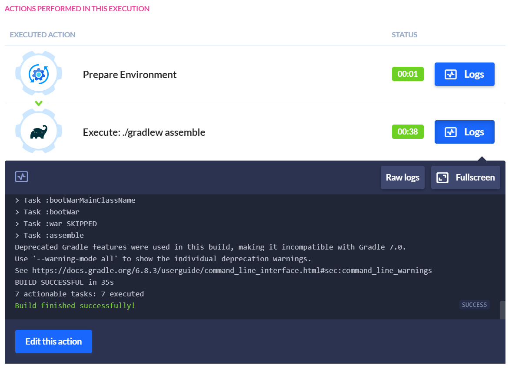
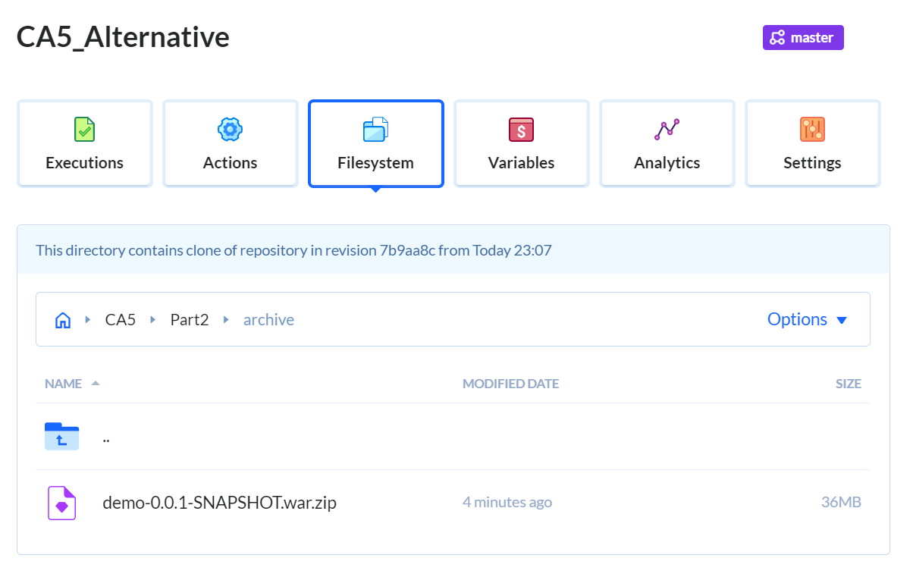
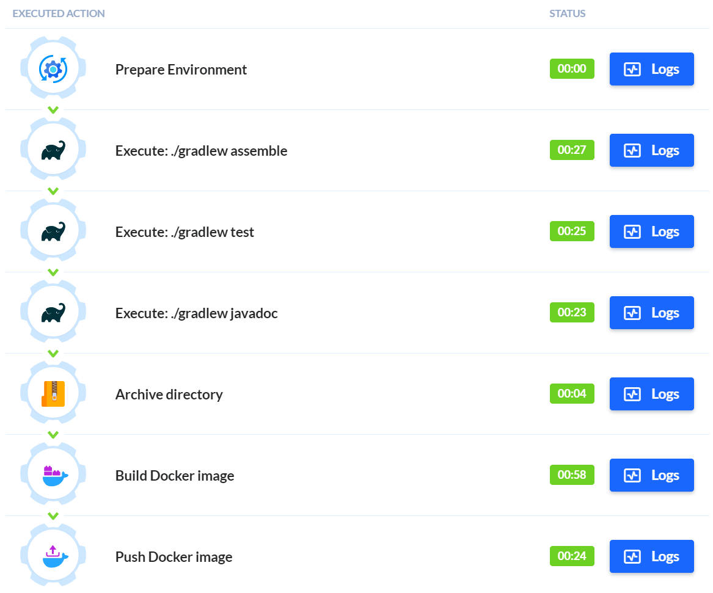

# CA5: Alternative README

The Readme is structure in 2 sections:

- **Alternative Analysis**: This part of the CA5 focuses on analysis possible Jenkins alternatives;
- **Buddy Steps**: This part of CA5 focuses on applying Continuous Integration and Delivery, by creating a pipeline in Buddy to build the
  tutorial spring boot application (CA2/Part2 project).

## CA5: Alternative Analysis

### Jenkins
So before we can go on to talk about our alternative, we should discuss Jenkins for a bit.

Jenkins is an essential tool in any DevOps operation. It is old, stable, open-source and free. All important characteristics that give Jenkins the reputation that it has.

That being said, Jenkins also has issues. It's age is starting to show, not only in terms of UI/UX, but also in terms of how it is built. Jenkins was not designed for the current trends of containerization and microservices architectures. 

One of its greatest strengths is the availability of plugins and integrations, since it has existed for so long and is so ubiquitous in the industry. That being said, a lot of plugins aren't being maintained, and some don't work with the newer Declarative style. 

### Enter Buddy

One of the first differences is that Buddy requires almost no setup to work. Their value is on making things as simple as needed and it shows. No installations are required to get applications running, no maintenance or fine-tuning.

While Jenkins follows a more freestyle approach to its Integrations, using open-source plugins, Buddy uses pre-made and tested integrations. The advantages are obvious, in that if you want to use one of the available integrations the setup is minimal, and it works out of the box and with every available integration. 

Obviously, this also means that Jenkins is more customizable for absolute DevOps gods, but plugins often interfere with each other in unexpected ways, increasing the complexity of using the tool.

This means that deploying to AWS or to Kubernetes is literally a few clicks away.

Buddy allows for pipeline creation in a couple of ways. One of which is a ```buddy.yaml``` which ahas a fairly simple syntax. But the absolute **MAXIMUM OVERDRIVE GAME-CHANGER** is the graphic interface. It is one of the simplest tools we've used in terms of UI/UX and the fact that integrations are all integrated and tested shows, in that the experience is catered to simplify the process of using all the integrations available. It's an absolute pleasure to use the tool, everything just flows and makes sense, even to relative newbies like us.

Finally in terms of pricing, Buddy does generally require a subscription, while Jenkins is free, but you should consider the hidden costs of using Jenkins. The headaches, the higher costs in employees, required knowledge and time to setup the tool and debug it.

If you have a robust DevOps team, and require taylor-made tools, Jenkins is probably a better option, but for someone who has very little experience in DevOps tools, it seems like a no-brainer to use Buddy. It just works.


## CA5: Buddy Steps

### 1. Create a Pipeline

#### 1.1. Register your account:
Register an account for Buddy at [their website](https://buddy.works).

#### 1.2. Create a new Project and link to your bitbucket Repository:


#### 1.3. In the Pipeline tab, click "Add a new pipeline":


#### 1.4. Set up the Pipeline


The Trigger mode is manually, so it only builds on request, and we selected the master branch as that is where we will be working.

We now have a Pipeline ready to go!
___

### 2. Create the necessary Actions

#### 2.1. Add an action for Gradle Assemble

Buddy has a lot of plugins readily available, thankfully Gradle is one of them.

In the Actions section, filter for Gradle:



The GUI supplies a command line where we can write our commands in BASH:


Since we'll be using the exact same project as in CA5/Part2 we will be using that directory to run supply the project files.

#### 2.2. Save and Run the pipeline:
Press the "Run pipeline" button:


Ah! The classic "Permission denied". We missed you, buddy!


We know how to fix this, same as all the other Class Assignments: go back to the BASH command and give the appropriate permissions:


We are now the proud makers of our first working Action in Buddy!



As you can see, it readily displays the console output, which comes in handy!

#### 2.3. Create the other Gradle Actions

Click the "+" button in the Actions view:


Use the same process as before for the gradle tasks:


It seems that the Javadoc files are automatically created in "build/docs/javadocs", so no need to supply a path, as we had to do in Jenkins.

Unfortunately, there seems to be no easy way to publish the javadocs, so we will have to move on.

Everything is working as expected until now:


#### 2.4. Create the Archive Action

Because we are smart (and lazy), we immediately search for an appropriate action using the "Archive" keyword and are presented with a *Zip* action. Similarly to the build.gradle task we had to do in CA2, which used "type: Zip".


Select the path to the war file:


We can also specify a destination, we will create an "archive" directory in the repository:


We can see the recently created zip in the "archive" directory:



#### 2.5. Create the Gradle Image and publish it:

Much like the other actions we started by searching by a Docker action:


We'll use this one to build the image based on the previously used dockerfile:


The "Push Image" Action will be used for, you guessed it, pushing the image to Docker Hub.

We need to set up a docker integration:


The process seems simple enough. Let's run the Pipeline!

##The dreaded path issue has occurred

Similarly to Part2 we had an issue with the path to the war file, but to fix it we just had to change the Context path in the Docker Image Action:

This happened because the dockerfile has the path to the file setup as starting already inside the CA5/Part2 folder. As such it didn't find the ../build/ folder if we didn't include the context path.


___
#SUCCESS



We are done with CA5!


