# CA5: Part1 README

The Readme is structure in 1 section:

- **Jenkins Steps** This part of CA5 focuses on applying Continuous Integration and Delivery using Jenkins;

## CA5: Jenkins Steps

___

### 0. Install jenkins

#### 0.1. Follow the steps on the jenkins website:

[Installing Jenkins](https://www.jenkins.io/doc/book/installing/)

#### 0.2. Check to see if you have jenkins running locally:

If you didn't specify anything different from the basic setup head on to

```localhost:8080```

You should have jenkins available:

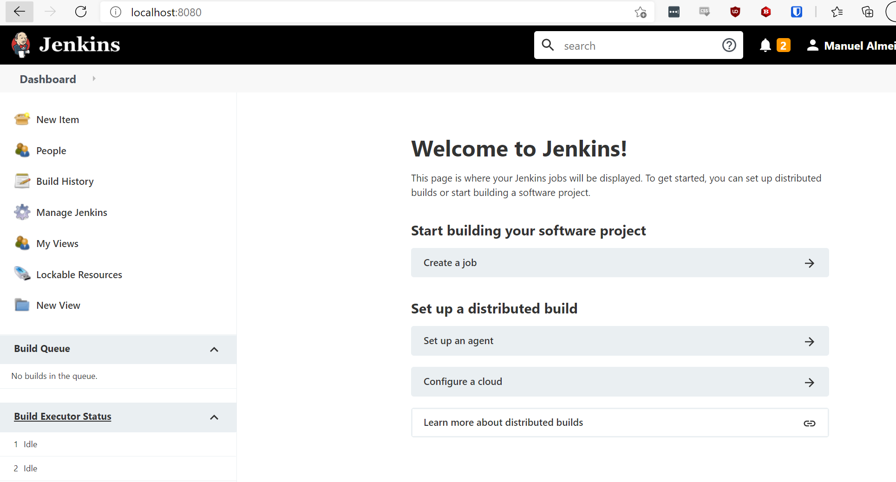

___

### 1. Creating a Pipeline

#### 1.1. Click on new Item:


#### 1.2. Give the item a name and select the Pipeline option:

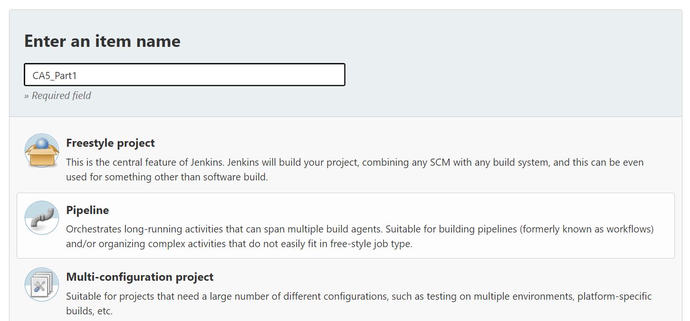

#### 1.3. In the Pipeline section of the setup, link the Pipeline to your git repository:

- 1.3.1. Change the Definition to Pipeline Script from SCM;
- 1.3.2. Change the SCM to git;
- 1.3.3. Input your own repository;
- 1.3.4. Save;

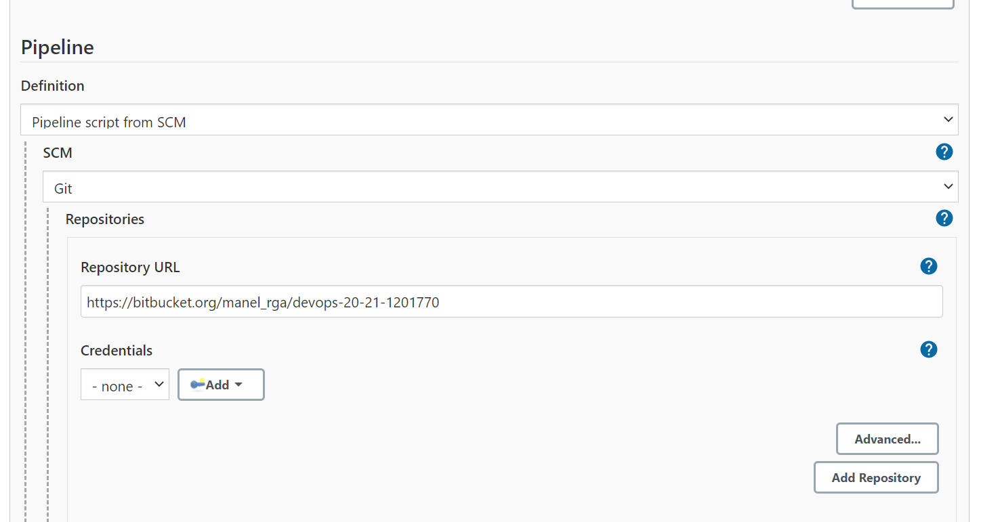
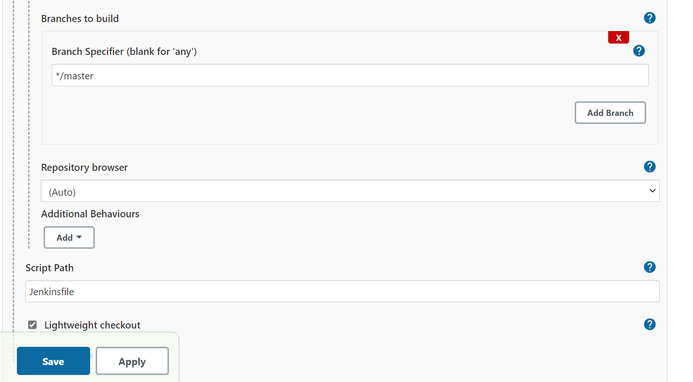

### 2. Create the Jenkinsfile

First, copy the CA2/Part1 project to the current folder, as it might need some adaptations to work.

Then let's go through the example Jenkinsfile provided by in the lecture:

```
pipeline {
    agent any

    stages {
        stage('Checkout') {
            steps {
                echo 'Checking out...'
                git  credentialsId: ’atb-bitbucket-credentials’, url: 
                        'https://bitbucket.org/atb/gradle_basic_demo'
            }
        }
        stage('Build') {
            steps {
                echo 'Building...'
                sh './gradlew clean build'
            }
        }
        stage('Archiving') {
            steps {
                echo 'Archiving...'
                archiveArtifacts 'build/distributions/*'
            }
        }
    }
}
```
#### 2.2. Make the necessary changes to Jenkinsfile:

Since our repository is public we can remove the git ```credentialsId``` section, and update the repository link:

```
stage('Checkout') {
            steps {
                echo 'Checking out...'
                git 'https://bitbucket.org/manel_rga/devops-20-21-1201770/src/master/CA5/Part1/'
            }
        }
```

#### 2.2. Push the changes to the remote directory!
___

### 3. Run the Pipeline

#### 3.1. Click the Build Now button:

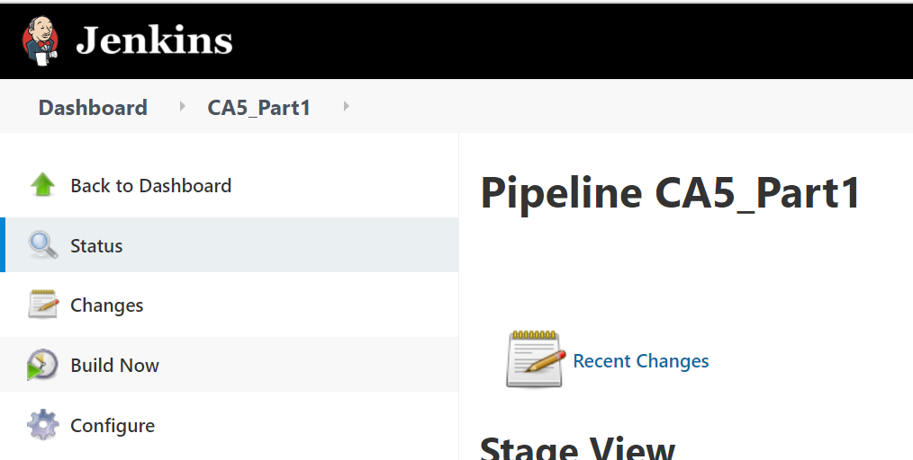

## And so it begins:
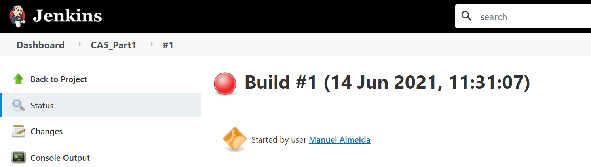

### 4. Make necessary changes to Jenkinsfile:

It turns out that we have to detail the folder in which gradle should be running. Also, we need to separate the assembling stage from the test stage as per the requirements of the assignment:

#### 4.1. Add the dir command;

#### 4.2. Create 2 stages, one for Assemble and one for Testing;

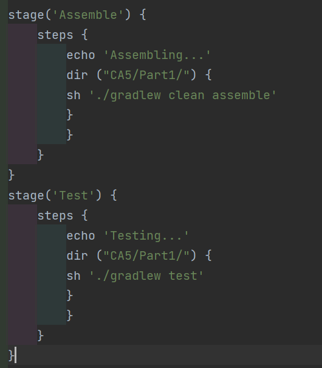

#### 4.3. Push and run it again!

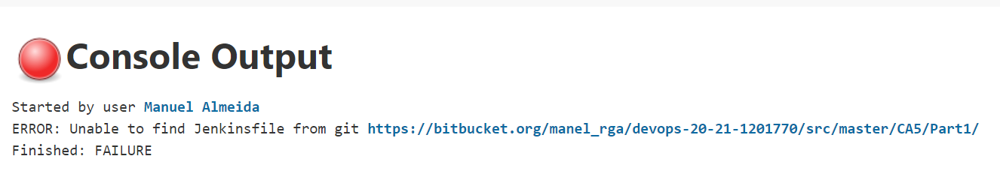

Life is pain

### 5. We need to go deeper

After consulting with members of my working group, a few suggested moving the Jenkinsfile to the root folder of the Repository. We'll try that.

#### 5.1. Move the Jenkinsfile to repository root;

## ERROR!

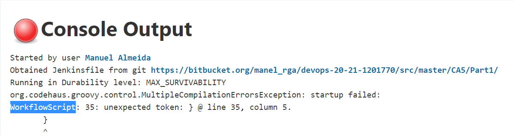

#### 5.2. Correct the brackets in Jenkinsfile

It seems we somehow added a bunch of unnecessary brackets to Jenkinsfile which are breaking the build.

### 6. Finally, rejoice at the lack of the RED BALL OF DISAPPOINTMENT

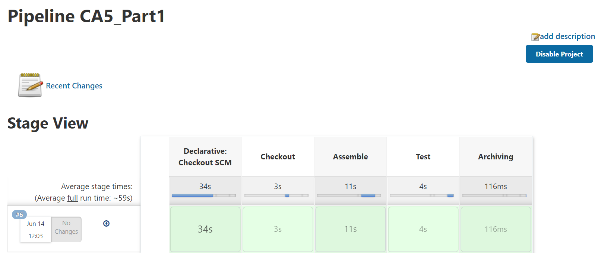

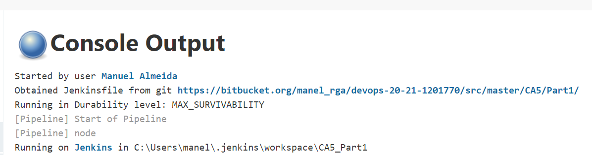

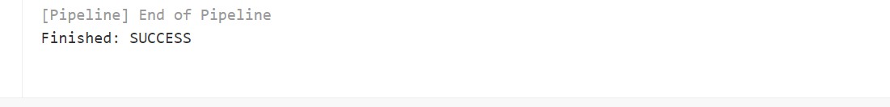

## We are done with Part1 of the Assignment!

*For the purpose of maintaining the original Jenkinsfile for this assignement, it was stored inside in the Archive folder. This is necessary because the jenkinsfile in the repository root folder will need to be changed for Part2 of the CA5*


