# CA5: Part2 README

The Readme is structure in 1 section:

- **Jenkins Steps**: This part of CA5 focuses on applying Continuous Integration and Delivery, by creating a pipeline in Jenkins to build the
  tutorial spring boot application (CA2/Part2 project);

## CA5: Jenkins Steps

___

### 1. Creating a new Pipeline

#### 1.1. Click on new Item:

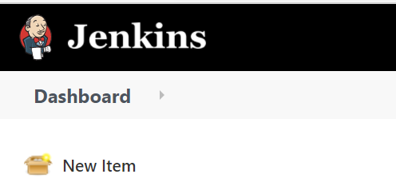

#### 1.2. Give the item a name and select the Pipeline option:

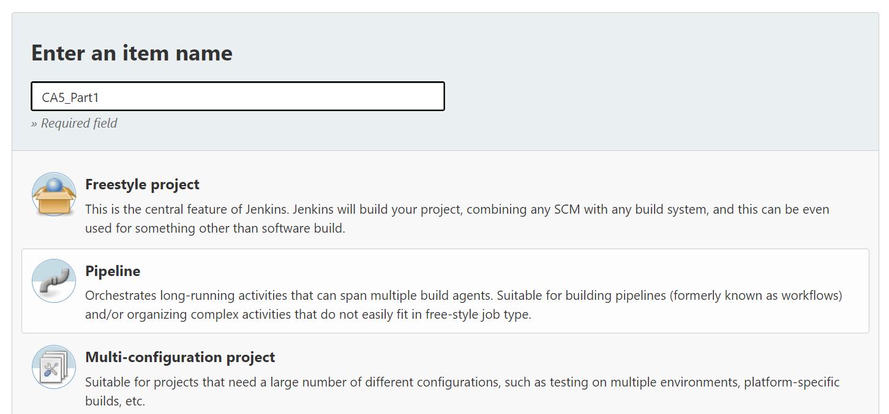

#### 1.3. In the Pipeline section of the setup, link the Pipeline to your git repository:

- 1.3.1. Change the Definition to Pipeline Script from SCM;
- 1.3.2. Change the SCM to git;
- 1.3.3. Input your own repository (use the actual directory for this CA5/Part2);
- 1.3.4. Save;

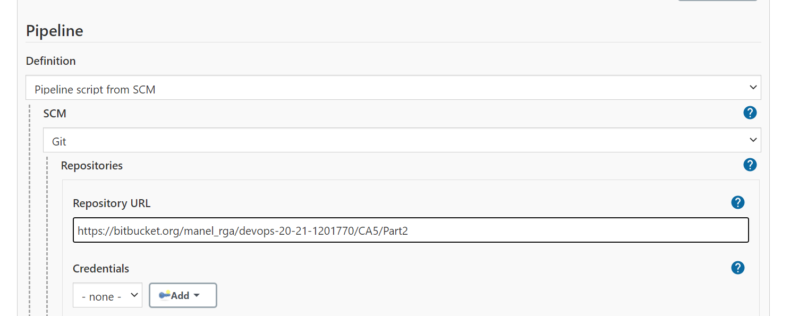


### 2. Create the Jenkinsfile

First, copy the CA2/Part2 project to the current folder, as it might need some adaptations to work.

We will be adapting the Jenkinsfile used in the previous Part.

#### 2.2. Add the Javadoc stage:

How, you may ask? That makes two of us!

After looking at solutions online a few things become clear. 

- 1. Install the Javadoc Plugin in Jenkins:
  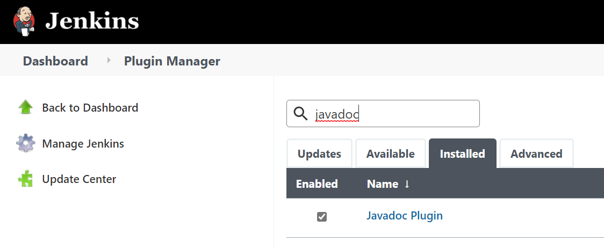
     
- 2. Use the handy Snippet Generator to generate the script we need for the Jenkinsfile:
  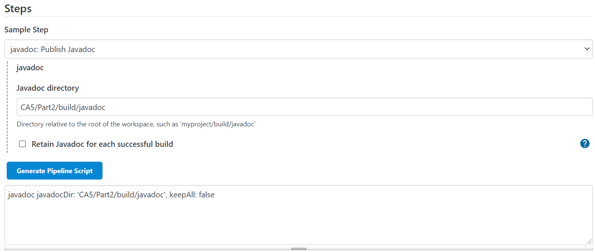
     
- 3. Add the script to the jenkinsfile in a Javadoc stage:

```
        stage('Javadoc') {
            steps {
                echo 'Creating Javadoc...'
                dir ("CA5/Part2/") {
                    sh './gradlew javadoc'
                    javadoc javadocDir: 'CA5/Part2/build/javadoc', keepAll: false
                }
            }
        }
```

#### 2.3. Push the changes to the remote directory!

#### 2.4. Let's try and Build this!

#### 2.5. Congratulations! You're the proud owner of a failing build!

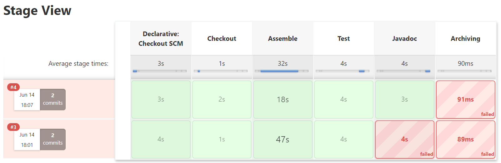

So the first issue is the Javadoc directory, we included the CA5/Part2 twice...

```
        stage('Javadoc') {
            steps {
                echo 'Creating Javadoc...'
                dir ("CA5/Part2/") {
                    sh './gradlew javadoc'
                    javadoc javadocDir: 'build/javadoc', keepAll: false
                }
            }
        }
```
That corrected the issued with Javadoc! Great!

Now onto the archiving issue!

#### 2.6. Add war file support to gradle.build:

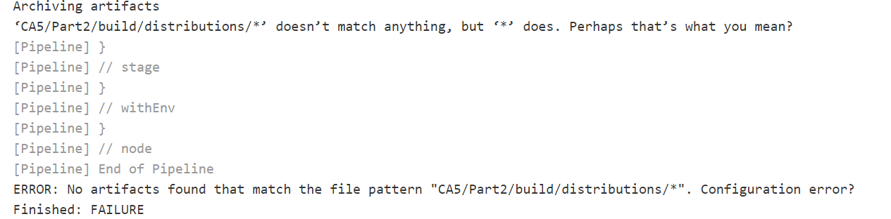

If you remember way back, when we were younger, happier, in better physical shape and generally healthier human beings (about 2 months ago) we had to do this same step for CA3. Also, the path isn't correct in the Jenkinsfile, again, so we need to update that as well!

In the gradle.build of the current project add the war plugin:

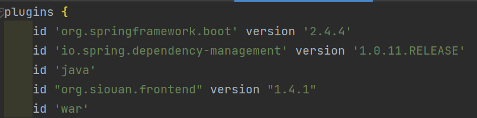

Change the path to the war file for archiving:

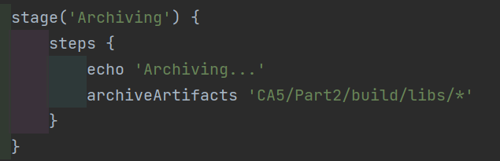

Build it again!

## WE HAVE LIFTOFF!

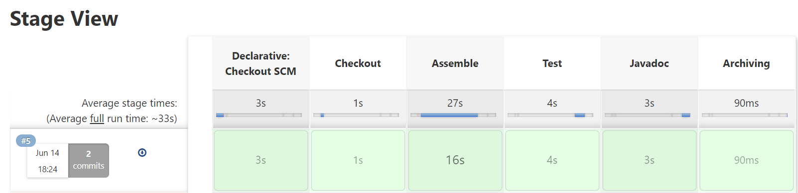
___

### 3. Publish the Javadoc

Ok, so we are generating the Javadoc, all we have to do now is to publish it in HTML.

#### 3.1. Install the HTML Publisher plugin in Jenkins:

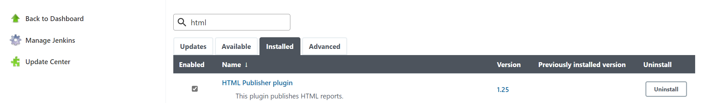

#### 3.2. Create the snippet in Pipelin Syntax:

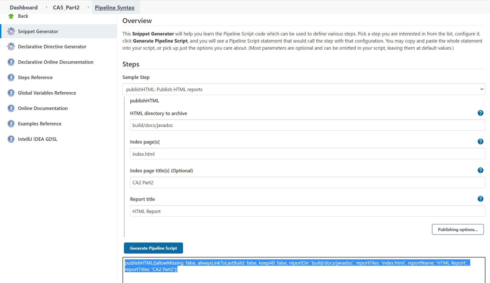

Copy the highlighted code and insert it into the Jenkinsfile so it looks as follows:

```
        stage('Javadoc') {
            steps {
                echo 'Creating Javadoc...'
                dir ("CA5/Part2/") {
                    sh './gradlew javadoc'
                    javadoc javadocDir: 'build/docs/javadoc', keepAll: false
                    publishHTML([allowMissing: false, alwaysLinkToLastBuild: false, keepAll: false, reportDir: 'build/docs/javadoc', reportFiles: 'index.html', reportName: 'HTML Report', reportTitles: 'CA2 Part2'])
                }
            }
        }
```
Push it and build the project!

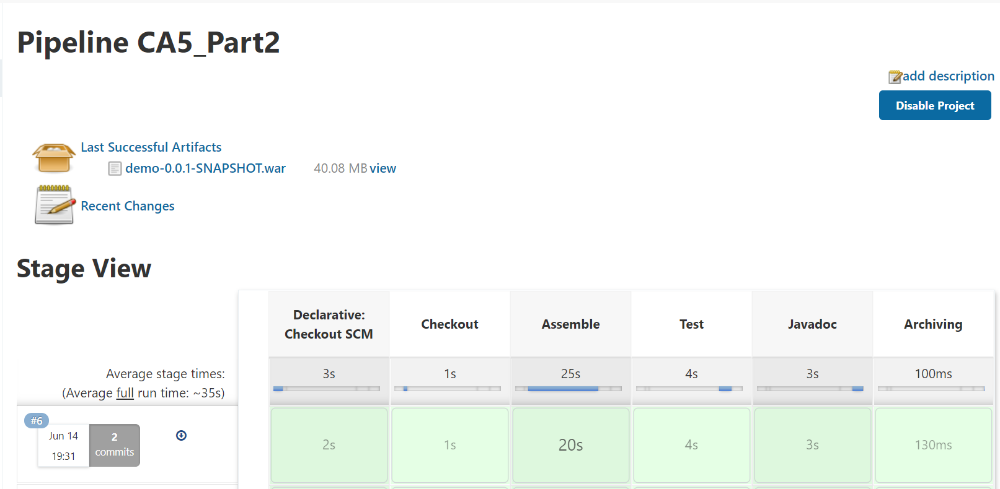


### 4. Generate a Docker imagine and publish it

#### 4.1. Start by creating the Dockerfile:

We will be copying and adapting a previous Dockerfile (the web one). 

The Dockerfiles we were using had a lot of functionality that is now done directly by Jenkins, so they'll be streamlined. By the end of our changes it should look something like this:

```
FROM tomcat

RUN apt-get update -y

RUN apt-get install -f

RUN apt-get install git -y

RUN apt-get install nodejs -y

RUN apt-get install npm -y

RUN mkdir -p /tmp/build

ADD CA5/Part2/build/libs/demo-basic-gradle-0.0.1-SNAPSHOT.war /usr/local/tomcat/webapps/

EXPOSE 8080
```

#### 4.2. Install the Docker plugins in Jenkins:

We chose the following as we were not quite sure which one is appropriate for our purposes (although we suspect it is the Pipelines one!):

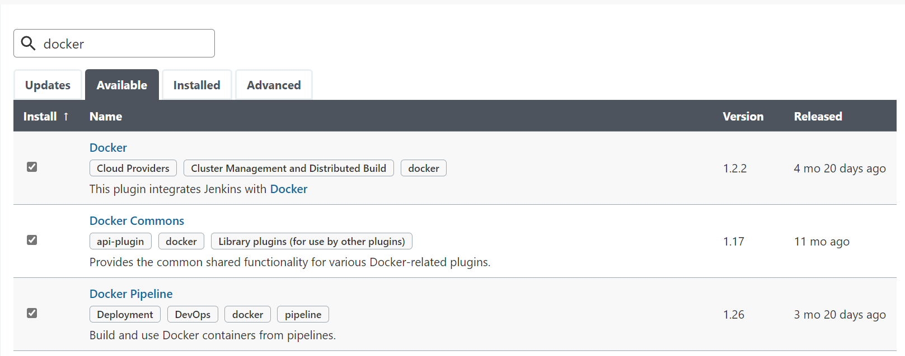


#### 4.3. Update the Jenkinsfile with a new Stage:

```
        stage('Docker Image') {
            steps {
                echo 'Generating Docker Image...'
                dir ("CA5/Part2/") {
                  Ca5_Image = docker.build("1201770/ca5_part2-image:${env.BUILD_ID}")
                  Ca5_Image.push()
                }
            }
        }
```

The build brakes due to some syntax error:

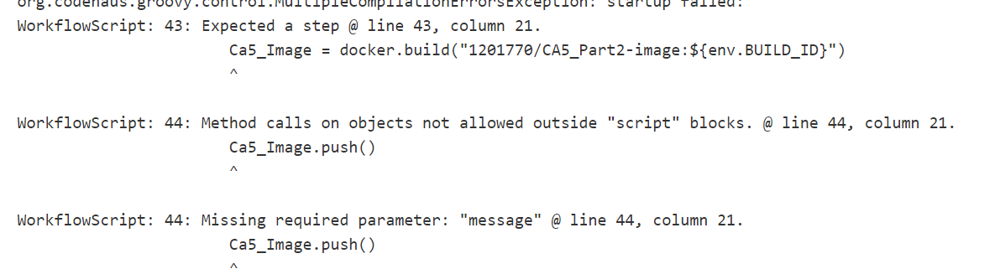

#### 4.4. Include the docker commands inside a script tag:
```
        stage('Docker Image') {
            steps {
                echo 'Generating Docker Image...'
                dir ("CA5/Part2/") {
                    script{
                        Ca5_Image = docker.build("1201770/CA5_Part2_image:${env.BUILD_ID}")
                        Ca5_Image.push()
                    }
                }
            }
        }
```

It brakes because, like the bells we are, we used upper case letters in the Image tag:

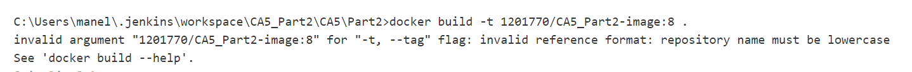

Correct this and go again!

Now the issue seems to be related to this buildkit file:

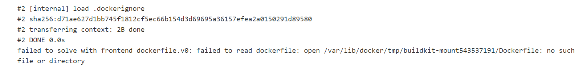

#### 4.5. Correct the buildkit issue:

After consulting the internet it seems that we can correct this issue if we make changes to a Docker settings file: ```daemon.json```. The easiest way to this is directly on the file or using the Docker GUI, which we will do:

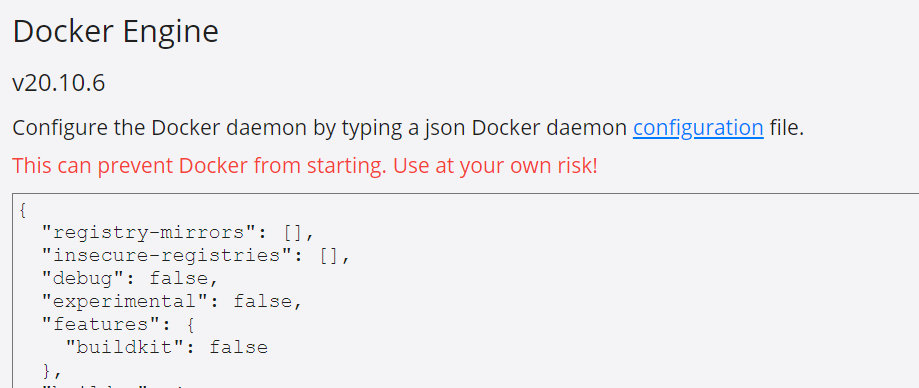

Restart docker!


After some issues with the paths to the war file, we notice that Jenkins actually tells the directory where it's working before the last step of the Dockerfile:

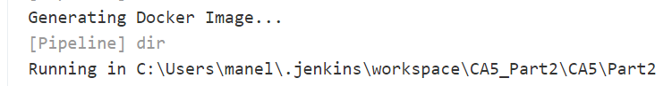

So update the Dockerfile to only include the directories after that one:
```
ADD build/libs/demo-0.0.1-SNAPSHOT.war /usr/local/tomcat/webapps/
```

Push the changes, build it again and voilà!

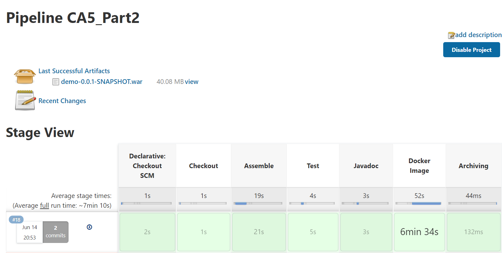

# CELEBRATE GOOD TIMES, COME ON!!


## We are done with Part2 of the Assignment!


